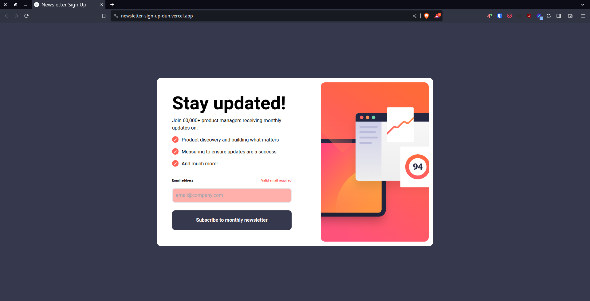

# Frontend Mentor - 3-column preview card component solution

This is a solution to the [3-column preview card component challenge on Frontend Mentor](https://www.frontendmentor.io/challenges/3column-preview-card-component-pH92eAR2-). Frontend Mentor challenges help you improve your coding skills by building realistic projects. 

## Table of contents

- [Overview](#overview)
  - [The challenge](#the-challenge)
  - [Screenshot](#screenshot)
  - [Links](#links)
- [My process](#my-process)
  - [Built with](#built-with)
  - [What I learned](#what-i-learned)
  - [Continued development](#continued-development)
  - [Useful resources](#useful-resources)
- [Author](#author)
- [Acknowledgments](#acknowledgments)

**Note: Delete this note and update the table of contents based on what sections you keep.**

## Overview

### The challenge

Users should be able to:

- View the optimal layout depending on their device's screen size
- See hover states for interactive elements

### Screenshot

### Links

- Solution URL: [https://github.com/cocotiwak/newsletter-sign-up](https://github.com/cocotiwak/newsletter-sign-up)
- Live Site URL: [https://newsletter-sign-up-dun.vercel.app/](https://newsletter-sign-up-dun.vercel.app/)

## My process

### Built with

- Semantic HTML5 markup
- Tailwind CSS
- Flexbox

### What I learned

### Continued development

### Useful resources

## Author

- Website - [Add your name here](https://www.your-site.com)
- Frontend Mentor - [@cocotiwak](https://www.frontendmentor.io/profile/cocotiwak)
- Twitter - [@kenyaldanbulat](https://www.twitter.com/kenyaldanbulat)

## Acknowledgments

This is where you can give a hat tip to anyone who helped you out on this project. Perhaps you worked in a team or got some inspiration from someone else's solution. This is the perfect place to give them some credit.

**Note: Delete this note and edit this section's content as necessary. If you completed this challenge by yourself, feel free to delete this section entirely.**
